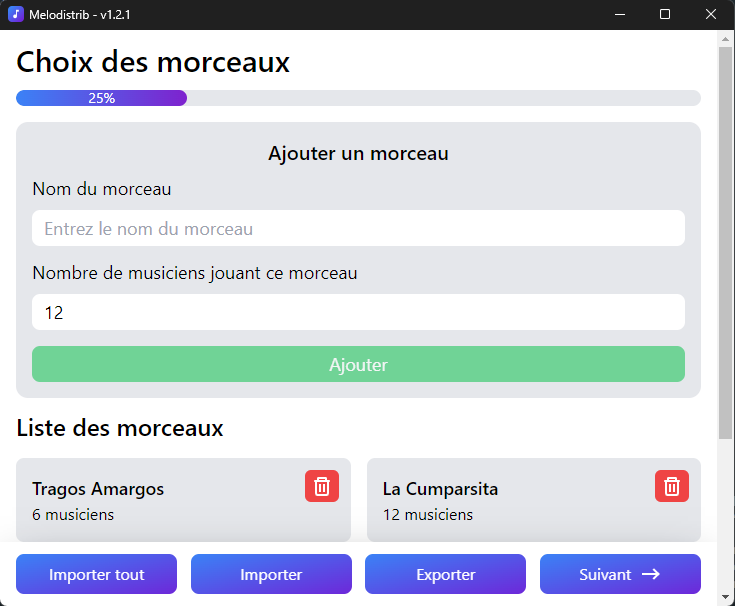
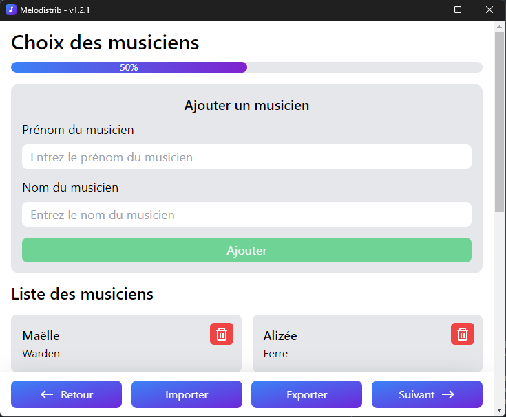
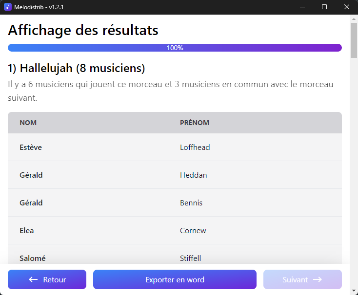

<p align="center" style="font-size: 32px">
  <br>Melodistrib
</p>


# Sommaire

- [Sommaire](#sommaire)
  - [Installation](#installation)
  - [Utilisation](#utilisation)
    - [1. Choix des morceaux](#1-choix-des-morceaux)
    - [2. Choix des musiciens](#2-choix-des-musiciens)
    - [3. Sélection des morceaux](#3-sélection-des-morceaux)
    - [4. Affichage des résultats](#4-affichage-des-résultats)
  - [Technologies utilisées](#technologies-utilisées)
  - [Recommandations de développement](#recommandations-de-développement)
  - [Développement](#développement)
    - [Installation des dépendances](#installation-des-dépendances)
    - [Démarrage en mode développement](#démarrage-en-mode-développement)
    - [Builder le logiciel avec Electron-Builder](#builder-le-logiciel-avec-electron-builder)
      - [Pour Windows](#pour-windows)
      - [Pour macOS](#pour-macos)
      - [Pour Linux](#pour-linux)
- [Contribuer à Mélodistrib](#contribuer-à-mélodistrib)
  - [Soumettre des problèmes](#soumettre-des-problèmes)
  - [Contribuer au code](#contribuer-au-code)
- [Licence](#licence)

Mélodistrib est un logiciel innovant conçu pour répartir équitablement des musiciens parmi une liste prédéfinie de morceaux, tout en optimisant l'enchaînement des morceaux pour minimiser les déplacements des artistes entre chaque morceau. Ce document fournit des informations détaillées sur l'installation, l'utilisation et le développement du logiciel.

## Installation

Pour installer Mélodistrib, suivez ces étapes simples :

1. Téléchargez le fichier d'installation depuis la section `Releases` du dépot GitHub ou en [cliquant ici](https://github.com/Zoliex/melodistrib/releases/download/v1.2.1/melodistrib-1.2.1-setup.exe).
2. Exécutez le fichier .exe téléchargé.
3. Le logiciel s'installera automatiquement, créera une icône sur le bureau et s'ouvrira automatiquement.

## Utilisation

### 1. Choix des morceaux

Sur la première page, `Choix des morceaux`, saisissez la liste des morceaux qui seront joués. Pour chaque morceau, spécifiez son nom et le nombre maximum de musiciens requis pour celui-ci, le logiciel n'attribuera pas le morceau à un musicien s'il ne l'a pas choisi, au contraire si trop de personnes ont sélectionné le morceau, il indiquera quelles personnes n'ont pas été attribuées au morceau. Utilisez les boutons `Exporter` et `Importer` pour sauvegarder ou charger la liste depuis dans un fichier au format .melt.



### 2. Choix des musiciens

Sur la deuxième page, `Choix des musiciens`, entrez les noms et prénoms des musiciens qui joueront les morceaux. Comme précédemment, utilisez les boutons `Exporter` et `Importer` pour gérer la liste des musiciens dans un fichier au format .melm.



### 3. Sélection des morceaux

Sur la dernière page avant les résultats, `Sélection des morceaux`, attribuez à chaque musicien les morceaux qu'il souhaite jouer en priorité. Vous pouvez également exporter et importer toutes les données avec les boutons `Exporter tout` et `Importer tout` dans un fichier au format .mels.


### 4. Affichage des résultats

Sur la dernière page, `Affichage des résultats`, visualisez l'enchaînement optimal des morceaux avec un tableau indiquant les artistes pour chaque morceau. Exportez les résultats au format Word avec le bouton `Exporter en word`.



## Technologies utilisées

Mélodistrib a été développé en utilisant les technologies suivantes :

   

## Recommandations de développement

Pour contribuer au développement de Mélodistrib, suivez ces recommandations :

- Éditeur: VSCode
- Outils: ESLint, Prettier, Volar

## Développement

### Installation des dépendances

```bash
$ npm install
```

### Démarrage en mode développement

```bash
$ npm run dev
```

### Builder le logiciel avec Electron-Builder

#### Pour Windows

```bash
$ npm run build:win
```

#### Pour macOS

```bash
$ npm run build:mac
```

#### Pour Linux

```bash
$ npm run build:linux
```

---

**Note:** Assurez-vous d'avoir Node.js installé sur votre système avant de suivre ces étapes.

# Contribuer à Mélodistrib

Si vous souhaitez contribuer, suivez ces étapes :

## Soumettre des problèmes

Si vous rencontrez des problèmes ou avez des idées d'amélioration, veuillez les soumettre sur la page "Issues" du référentiel GitHub en [cliquant ici](https://github.com/Zoliex/melodistrib/issues). Assurez-vous de fournir des informations détaillées sur le problème rencontré ou la fonctionnalité proposée.

## Contribuer au code

1. **Fork du référentiel :** Commencez par forker le référentiel Mélodistrib sur GitHub.

2. **Clone du fork :** Clonez votre fork sur votre machine locale.

   ```bash
   git clone https://github.com/<votre-pseudo>/melodistrib.git
   ```

3. **Création d'une branche :** Créez une branche pour travailler sur votre contribution.

   ```bash
   git checkout -b nom-de-ma-branche
   ```

4. **Installation des dépendances :** Assurez-vous d'avoir les dépendances nécessaires installées.

   ```bash
   npm install
   ```

5. **Effectuer des modifications :** Faites les modifications nécessaires et testez-les localement.

6. **Validation des modifications :** Assurez-vous que votre code respecte les recommandations d'ESLint et de Prettier.

   ```bash
   npm run lint
   npm run format
   ```

7. **Soumettre les modifications :** Une fois vos modifications testées, effectuez un commit et poussez-les sur votre fork.

   ```bash
   git commit -m "Description des modifications"
   git push origin nom-de-ma-branche
   ```

8. **Création d'une pull request :** Sur la page GitHub de votre fork, créez une pull request en sélectionnant la branche que vous venez de pousser.

Mélodistrib simplifie le processus de planification musicale en répartissant intelligemment les musiciens et en optimisant l'enchaînement des morceaux. Profitez de cette solution intuitive et gagnez du temps dans l'organisation de vos événements musicaux !

# Licence

Mélodistrib est sous licence GPLv3 - voir le fichier [LICENSE](LICENSE) pour plus de détails.

Logiciel créé et développé par [Zoliex](https://github.com/Zoliex)
